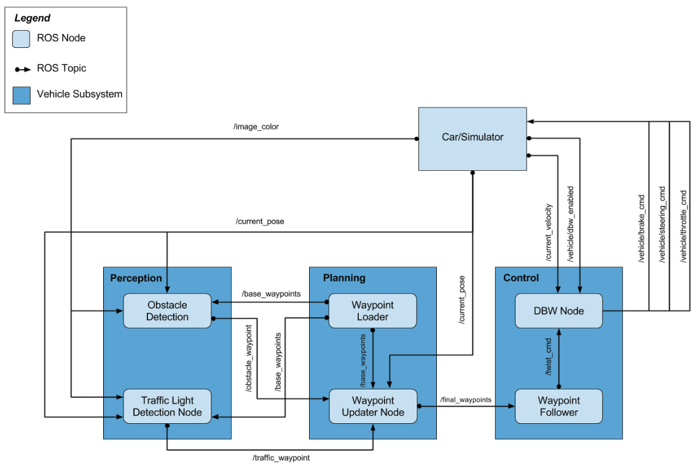

# The Swift
### Swift Team
* Tom Odwald: Tomasz.Odwald@gmail.com
* Vinod Radhakrishnan: vinod_rad@yahoo.com
* Alex Santos: alejandro.diaz.santos@gmail.com
* Elias Zimmermann: elias.zimmermann@rafi.de
* Anup Nayak: anup.nayak@gmail.com


## Introduction
The goal of this Capstone project was to provide a system which integrates multiple components to drive the Udacity self-driving car "Carla" around a test track.

To achieve this goal we enhanced the baseline code provided by Udacity and made improvements to all 3 logical subsystems.
1. Perception, by implementing a Deep-Neural Network based traffic light detection algorithm
2. Planning, by improving the waypoint estimation algorithm to provide responsive and smoooth velocity profiles, and 
3. Control, by providing actuator control commands which adhere to the planned waypoints with minimal jerk.

The following subsections will detail the improvements for each category.




### Perception
#### Obstacle Detection
No changes were made to this module.
#### Traffic Light Detection
For the traffic light detection there are two steps needed: 
1. Detecting a traffic light 
2. Classification of the traffic light. 
We decided to create a single shot detector including both steps in one.

The resulting model is based on the Tensorflow API. A pretrained object detection model named 'ssd_mobilenet_v1_coco' is provided in this API. Using the Bosch Small Traffic Lights Dataset the model is trained to fullfil our requirements for the test track. To test the source code on a simulator a further model is provided which used the Udacity Simulator based traffic light data to train it. In addition, to minimize some latency issues we were having, we only process every 6th image frame for traffic lights.

A link to this work is provided [here]( https://github.com/alejandrods/Tensorflow_API_traffic_light_detection/blob/master/object_detection_tutorial.ipynb).

### Planning
#### Waypoint Loader
We updated the waypoint loader launch file to specify the number of waypoints published to the waypoint-follower node, as well as the number of waypoints we use to lookahead for traffic lights. After some experimentation, these values are set as follows:

1. For the simulator track, we publish 30 waypoints to the waypoint-follower node, while simultaneously using 125 waypoints of lookahead for Traffic Lights so we can provide a longer response window and smoother deceleration when a yellow or red traffic signal is detected.
1. For the site track, we use 10 waypoints for both publishing to the waypoint-follower node, and as lookahead for Traffic Lights.

#### Waypoint Updater

The waypoint updater node is responsible for calculating and publishing the list of waypoints which includes position and linear/angular velocity to the waypoint_follower node at a periodic rate of 25Hz. Having too many waypoints can increase the computation burden which results in latency issues. On the other hand, having too few waypoints can lead to jerky deceleration when a traffic light turns yellow or red. To overcome this, we only publish 30 waypoints to the waypoint-follower node at any given time in the case of the simulated track. However the velocity profile is computed based on a much longer time frame of 125 waypoints so we can detect changing traffic lights in a timely manner and provide a smooth deceleration response. This is shown in the picture below.


### Control
#### Drive-By-Wire (DBW) Node 
We experimented with different settings for the PID parameters for smooth acceleration response, as well as with the max deceleration parameter to provide smooth stopping behavior. We also updated the Drive-By-Wire (DBW) node to use the distance to the stopline for a traffic-light to decide when to apply maximum braking torque. The following video shows the performance of the car in the Simulator track, as well as some parameters we monitor to ensure that jerk is kept to a minimum. [NOTE: We built on the debug tool initially developed by Kairos-Automotive team in their project]

[](https://youtu.be/ZpW9HxBtKtc)
 
In addition to the simulator, we also ensured that our traffic-light detection system worked with the Rosbag video from the test site. See video of this below.
[](https://youtu.be/CoQjcoJY8Us)

Finally, we also verified that our code worked with the simulation of the site track, after reducing the number of waypoints to follow appropriately. See below.
[](https://youtu.be/rgV8qvr6S5s)

#### Waypoint follower
No changes were made to this module.

### Usage

1. Clone the project repository
```bash
git clone https://github.com/AnupNayakGitHub/CarND-Capstone
```

2. Install python dependencies
```bash
cd CarND-Capstone
pip install -r requirements.txt
```
3. Make and run styx
```bash
cd ros
catkin_make
source devel/setup.sh
roslaunch launch/styx.launch
```
4. Run the simulator

### Real world testing
1. Download [training bag](https://s3-us-west-1.amazonaws.com/udacity-selfdrivingcar/traffic_light_bag_file.zip) that was recorded on the Udacity self-driving car.
```bash
wget https://s3-us-west-1.amazonaws.com/udacity-selfdrivingcar/traffic_light_bag_file.zip
```
2. Unzip the file
```bash
unzip traffic_light_bag_file.zip
```
3. Play the bag file
```bash
rosbag play -l traffic_light_bag_file/traffic_light_training.bag
```
4. Launch your project in site mode
```bash
cd CarND-Capstone/ros
roslaunch launch/site.launch
```
5. Confirm that traffic light detection works on real life images

## Conclusion
We took the opportunity to build a small team working from different time zone. Our approach was for each team member to learn from every part of change and improvement. We periodically identified next set of improvements and each member to work on identifed improvements. At the same time, periodically reviewed the recent improvements and merged to retain the best solution. This excercise exposed each of us to all parts of the project.
